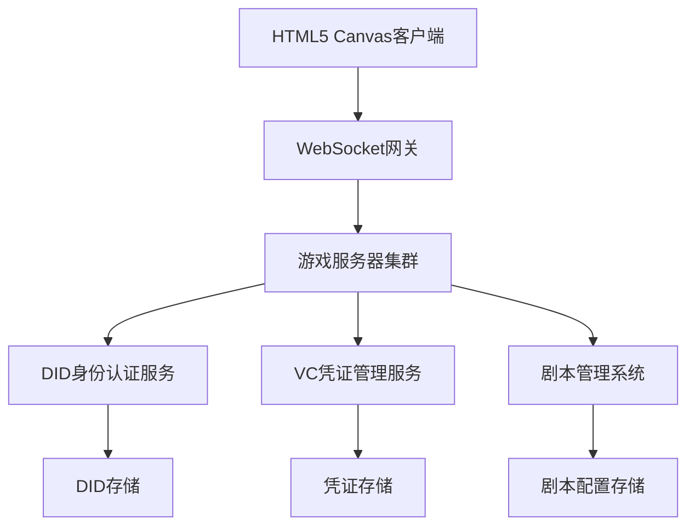

## 产品概述

基于Aries-hyperledger-go开发的多账号游戏系统，集成分布式身份认证和实时多人在线游戏功能。系统采用自定义DID方法管理玩家身份，使用W3C标准凭证进行权限验证，支持管理员创建和管理游戏剧本。

## 核心功能

- 自定义did:player身份认证系统，支持玩家DID创建、验证和管理
- W3C Verifiable Credentials凭证管理，包括凭证颁发、验证和撤销
- HTML5 Canvas实时多人在线游戏客户端，支持WebSocket实时通信
- Go语言游戏服务器，处理游戏逻辑、状态同步和玩家交互
- 管理员剧本系统，支持自定义游戏场景、规则和任务配置
- 分布式部署架构，支持多节点负载均衡和高可用性

## 技术栈选择

- **前端**: HTML5 Canvas + JavaScript + WebSocket
- **后端**: Go + net/http + WebSocket + Aries-hyperledger-go
- **身份认证**: 自定义did:player方法 + W3C Verifiable Credentials
- **通信协议**: WebSocket实时通信 + RESTful API
- **部署**: 分布式部署架构

## 系统架构

### 整体架构

采用分层架构模式，包含表示层（HTML5客户端）、业务逻辑层（Go游戏服务器）、身份认证层（DID/VC系统）和数据持久化层。



### 模块划分

- **客户端模块**: HTML5 Canvas游戏渲染引擎、WebSocket通信管理器、用户界面组件
- **服务器核心模块**: 游戏逻辑处理器、玩家状态管理器、实时消息分发器
- **身份认证模块**: DID解析器、VC验证器、Aries-hyperledger-go集成层
- **剧本系统模块**: 剧本编辑器、规则引擎、任务管理器

### 数据流

玩家登录 → DID身份验证 → VC凭证检查 → 游戏房间匹配 → 实时游戏交互 → 状态同步 → 结果记录

## 实现细节

### 核心目录结构

```
aries-game-system/
├── client/                 # HTML5客户端
│   ├── src/
│   │   ├── engine/        # Canvas游戏引擎
│   │   ├── network/       # WebSocket通信
│   │   └── ui/            # 用户界面
│   └── assets/            # 游戏资源
├── server/                # Go服务器
│   ├── cmd/               # 服务器启动入口
│   ├── internal/
│   │   ├── game/          # 游戏逻辑
│   │   ├── did/           # DID身份认证
│   │   ├── vc/            # VC凭证管理
│   │   └── script/        # 剧本系统
│   └── pkg/               # 公共库
└── docs/                  # 文档
```

### 关键代码结构

**PlayerDID接口**: 定义自定义did:player方法的核心数据结构，包含玩家唯一标识符、公钥信息和身份验证元数据。

```
type PlayerDID struct {
    ID        string    `json:"id"`
    PublicKey string    `json:"publicKey"`
    Method    string    `json:"method"`
    CreatedAt time.Time `json:"createdAt"`
}
```

**GameCredential结构**: 实现W3C Verifiable Credentials标准的游戏凭证，用于玩家权限验证和游戏资产管理。

```
type GameCredential struct {
    Context    []string    `json:"@context"`
    Type       []string    `json:"type"`
    Issuer     string      `json:"issuer"`
    Subject    string      `json:"credentialSubject"`
    IssuedAt   time.Time   `json:"issuanceDate"`
    ExpiresAt  *time.Time  `json:"expirationDate,omitempty"`
}
```

### 技术实现方案

#### DID身份认证系统

1. **问题描述**: 实现自定义did:player方法，支持玩家身份的创建、解析和验证
2. **解决方案**: 基于Aries-hyperledger-go框架，扩展DID解析器，实现player方法的规范
3. **关键技术**: Hyperledger Aries DID库、加密签名验证、分布式身份存储
4. **实现步骤**: 

- 定义did:player方法规范
- 实现DID文档生成器
- 集成Aries DID解析器
- 添加身份验证中间件

5. **测试策略**: 单元测试DID创建和解析，集成测试身份验证流程

#### 实时游戏通信

1. **问题描述**: 实现低延迟的多人实时游戏通信和状态同步
2. **解决方案**: 使用WebSocket建立持久连接，实现自定义消息协议和状态同步机制
3. **关键技术**: WebSocket、消息队列、状态差分算法
4. **实现步骤**:

- 设计游戏消息协议
- 实现WebSocket连接管理
- 开发状态同步算法
- 添加断线重连机制

5. **测试策略**: 压力测试并发连接数，延迟测试消息传输速度

### 集成点

- **DID与游戏服务器**: 通过RESTful API进行身份验证和凭证验证
- **客户端与服务器**: WebSocket实时通信，JSON消息格式
- **剧本系统与游戏逻辑**: 配置文件驱动的规则引擎集成
- **分布式节点**: 服务发现和负载均衡机制

## 技术考虑

### 性能优化

- Canvas渲染优化：对象池、批量绘制、帧率控制
- 网络优化：消息压缩、状态差分、连接复用
- 服务器优化：goroutine池、内存缓存、数据库连接池

### 安全措施

- DID身份验证：数字签名验证、防重放攻击
- 凭证安全：加密存储、过期检查、撤销列表
- 通信安全：WebSocket TLS加密、消息完整性校验

### 可扩展性

- 水平扩展：微服务架构、负载均衡、数据分片
- 垂直扩展：资源监控、自动伸缩、性能调优

## 推荐的代理扩展

### SubAgent

- **code-explorer**
- 目的：探索现有的Aries-hyperledger-go代码库结构，分析DID和VC相关的API接口
- 预期结果：获得详细的代码结构分析和集成点识别，为自定义did:player方法提供技术基础